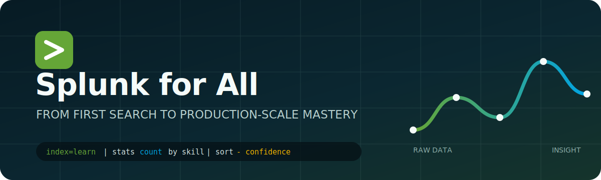

<div align="center">
  

  # Splunk for All

  **A free, hands-on path from your first Splunk search to production-scale SPL, administration, security, and observability.**

  [](#learning-path)
  [](labs/README.md)
  [](reference/spl-cheatsheet.md)
  [](LICENSE)

  [Start learning](docs/00-start-here.md) · [SPL cheat sheet](reference/spl-cheatsheet.md) · [Practice labs](labs/README.md) · [Glossary](reference/glossary.md)
</div>

---

## Why This Repository?

Splunk can feel like several products at once: a search language, a data platform, an operations console, a security analytics engine, and an administration discipline. This repository connects those pieces in one ordered curriculum.

Every chapter uses the same rhythm:

1. **Understand** the idea and when it matters.
2. **See** annotated, copy-ready SPL.
3. **Practice** against included sample data.
4. **Check** your reasoning with solutions and production notes.

You can use the material with Splunk Enterprise, a suitable Splunk Cloud Platform environment, or as a query reference. Product access and some administrative features depend on your deployment and role.

## What You Will Learn

| Track | Outcomes |
|---|---|
| Foundations | Splunk architecture, data flow, indexes, events, fields, time, and the Search app |
| SPL | Filtering, transforming, statistics, charts, lookups, subsearches, regex, JSON, and multivalue data |
| Expert search | `tstats`, data models, acceleration, reusable knowledge objects, optimization, and troubleshooting |
| Platform | Inputs, parsing, configuration files, distributed architecture, RBAC, monitoring, and lifecycle planning |
| Use cases | Security detections, investigations, service health, logs, metrics, traces, and IT operations |
| Practice | Guided labs with web, authentication, and commerce data plus challenge-style capstones |

## Learning Path

Choose the path that matches your goal, or follow the full sequence.

### 1. Beginner: Build The Mental Model

- [Start here and set up a lab](docs/00-start-here.md)
- [What Splunk is and how data flows](docs/01-foundations/01-what-is-splunk.md)
- [Architecture: forwarders, indexers, and search heads](docs/01-foundations/02-architecture.md)
- [Getting data in safely](docs/01-foundations/03-getting-data-in.md)
- [Your first searches](docs/02-spl/01-search-fundamentals.md)

### 2. Intermediate: Become Fluent In SPL

- [Fields, filtering, and data shaping](docs/02-spl/02-fields-and-filtering.md)
- [Statistics and time series](docs/02-spl/03-statistics-and-time.md)
- [Lookups, joins, and subsearches](docs/02-spl/04-enrichment-and-correlation.md)
- [Regex, JSON, and multivalue data](docs/02-spl/05-advanced-data-shaping.md)
- [Dashboards, alerts, and reports](docs/03-knowledge/01-search-products.md)

### 3. Advanced: Search Like A Practitioner

- [Knowledge objects and reusable content](docs/03-knowledge/02-knowledge-objects.md)
- [Data models, CIM, and `tstats`](docs/03-knowledge/03-data-models-and-tstats.md)
- [Search performance engineering](docs/04-advanced/01-performance.md)
- [Advanced search patterns](docs/04-advanced/02-advanced-patterns.md)
- [REST API and automation](docs/04-advanced/03-api-and-automation.md)

### 4. Platform: Run Splunk Responsibly

- [Configuration files and precedence](docs/05-admin/01-configuration.md)
- [Distributed deployments and scaling](docs/05-admin/02-distributed-deployment.md)
- [Security, RBAC, and hardening](docs/05-admin/03-security-and-rbac.md)
- [Monitoring and troubleshooting](docs/05-admin/04-monitoring-and-troubleshooting.md)

### 5. Applied Tracks

- [Splunk for security analytics](docs/06-use-cases/01-security.md)
- [Splunk for observability](docs/06-use-cases/02-observability.md)
- [Splunk for IT operations](docs/06-use-cases/03-it-operations.md)
- [Certification and career roadmap](docs/07-career-roadmap.md)

## Learn By Doing

The [`datasets/`](datasets/README.md) directory contains small, synthetic datasets that are safe to publish and easy to understand. The labs build on one another:

| Lab | Skill | Level |
|---|---|---|
| [01: Search flight school](labs/01-search-basics.md) | Filtering, fields, sorting, tables | Beginner |
| [02: Web reliability](labs/02-web-analytics.md) | `stats`, `timechart`, latency, error rates | Intermediate |
| [03: Authentication hunt](labs/03-security-investigation.md) | Correlation, detection logic, investigation | Intermediate |
| [04: SPL performance clinic](labs/04-performance-clinic.md) | Job Inspector, search reduction, `tstats` thinking | Advanced |
| [05: Capstone](labs/05-capstone.md) | End-to-end operational dashboard and alert design | Advanced |

Solutions are in [`labs/solutions/`](labs/solutions/README.md). Try the lab first; SPL is learned by forming and testing hypotheses.

## SPL In 60 Seconds

```spl
index=web sourcetype=access_combined status>=500 earliest=-24h
| eval latency_ms=round(response_time*1000, 0)
| timechart span=15m count AS errors, p95(latency_ms) AS p95_latency_ms BY host
```

Read left to right:

1. Find recent server-error events in the `web` index.
2. Derive a latency field in milliseconds.
3. Produce 15-minute error and latency series split by host.

Then ask the production questions: Is the time range selective? Are `index` and `sourcetype` explicit? Is `response_time` consistently typed? Does the split create too many series? What action follows the result?

## Repository Map

```text
Splunk For All/
├── docs/          # Ordered curriculum: foundations to production
├── datasets/      # Synthetic practice data and ingestion notes
├── labs/          # Exercises, capstones, and checked solutions
├── reference/     # Cheat sheets, command map, glossary, troubleshooting
├── examples/      # Reusable SPL searches and configuration examples
├── scripts/       # Dependency-free repository validation
├── assets/        # Visual identity
└── .github/       # Issue forms, pull request template, CI
```

## Accuracy And Scope

This is an independent, community learning project. It is not official Splunk documentation and is not affiliated with or endorsed by Splunk Inc. Splunk, SPL, and related names may be trademarks of Splunk Inc. Product behavior changes by release, deployment type, license, app, and permissions. Use the linked official documentation as the authority for your environment:

- [Splunk documentation](https://help.splunk.com/)
- [Search Reference](https://help.splunk.com/en/splunk-enterprise/search/spl-search-reference)
- [Splunk Lantern](https://lantern.splunk.com/)
- [Splunk Security Content](https://research.splunk.com/)
- [Splunk Education](https://www.splunk.com/en_us/training.html)

Examples use synthetic data and generic index names. Never paste secrets, tokens, customer data, or unrestricted destructive commands into a shared environment.

## Contributing

Corrections, new examples, translations, diagrams, and labs are welcome. Read [CONTRIBUTING.md](CONTRIBUTING.md), use the lesson template, and run:

```powershell
python scripts/validate_repo.py
```

The validator checks internal Markdown links, required lesson sections, SPL fences, and dataset structure without third-party packages.

## License

Code and original learning material are available under the [MIT License](LICENSE). External product names and linked documentation remain the property of their respective owners.

